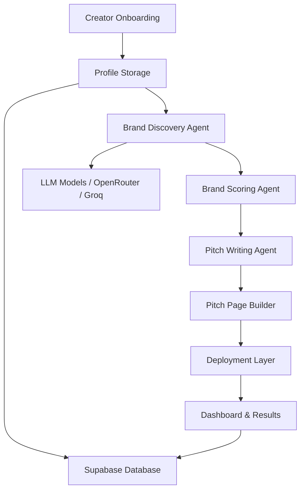

# Sponsorship

## Abstract

Sponsorship is an AI-assisted creator partnership platform designed to transform a creator’s profile into a structured sponsorship pipeline. The system combines onboarding, brand discovery, intelligent scoring, personalized pitch generation, and deployment-ready pitch pages into a single end-to-end workflow.

The platform is built to reduce the manual effort involved in finding brand opportunities and preparing outreach assets, allowing creators to move from discovery to pitch preparation with significantly less friction.

---

## Overview

Sponsorship helps creators:
- discover relevant brands aligned with their niche and audience
- evaluate brand fit using a scoring framework
- generate persuasive outreach materials tailored to each opportunity
- produce cinematic pitch pages for presentation and deployment
- manage the resulting brand leads and pitch assets from a unified dashboard

This project is designed as a production-oriented prototype for modern creator commerce workflows, combining a polished frontend experience with a backend orchestration layer powered by AI agents.

---

## Product Vision

The long-term objective is to create a dependable operating system for creator-brand partnerships, where the platform can:
- surface high-fit sponsorship opportunities automatically
- personalize outreach at scale
- accelerate deal discovery and follow-up
- provide creators with a modern, trustworthy interface for collaboration management

---

## System Architecture



### Architectural Components
- Frontend: React + Vite + Tailwind CSS for a modern, responsive experience
- Backend: Node.js + Express for API orchestration and authentication integration
- Data Layer: Supabase for profile, lead, pitch, and run-state persistence
- Intelligence Layer: orchestrated agents for brand discovery, scoring, drafting, and deployment
- Delivery Layer: generated pitch pages and deployment-ready assets for outreach

---

## Key Features

### 1. Creator-Centric Onboarding
Users can define their profile, audience, niche, pricing expectations, and content characteristics so that the system can reason about relevant sponsorship opportunities.

### 2. Intelligent Brand Discovery
The platform searches for brands that match the creator’s profile and markets them against relevance, audience fit, and deal potential.

### 3. Scoring and Prioritization
Each brand is evaluated through an internal scoring pipeline to prioritize opportunities that are more likely to convert.

### 4. Automated Pitch Generation
The system generates customized outreach copy and branded pitch assets based on each opportunity and the creator’s identity.

### 5. Pitch Page Creation
Each pitch can be represented as a deployment-ready landing page that communicates the partnership narrative clearly and elegantly.

### 6. Dashboard Experience
A unified dashboard allows creators to review discovered brands, generated pitches, and deployment status.

---

## Technology Stack

### Frontend
- React
- Vite
- Tailwind CSS
- React Router

### Backend
- Node.js
- Express
- dotenv
- CORS

### Data & Auth
- Supabase
- Supabase Auth

### AI / Orchestration
- OpenRouter
- Groq
- Custom multi-agent orchestration pipeline

---

## Project Structure

```text
agents/              # Brand discovery, scoring, pitching, and deployment agents
backend/             # API server and request orchestration
database/            # SQL schema and persistence definitions
docs/                # Generated pitch samples and design artifacts
frontend/            # React application and UI components
scripts/             # Utility and migration scripts
```

---

## Quick Start

### 1. Clone the repository
```bash
git clone https://github.com/Vidhyalakshmib1305/Sponsorship.git
cd Sponsorship
```

### 2. Install dependencies
```bash
npm install
cd frontend
npm install
cd ..
```

### 3. Configure environment variables
Create a local `.env` file using the provided `.env.example` as a template.

Required configuration includes:
- Supabase URL and service role credentials
- OpenRouter or Groq API keys
- App URL and deployment configuration values

### 4. Start the application
```bash
node backend/server.js
```

In a separate terminal:
```bash
cd frontend
npm run dev
```

The frontend will typically run on the Vite local development server, while the backend API runs on the Express server.

---

## Core Workflow

1. The creator completes onboarding and profile setup.
2. The system discovers relevant sponsorship opportunities.
3. Brands are scored for fit and prioritization.
4. Personalized pitches and landing pages are generated.
5. Results are stored and surfaced in the dashboard for ongoing review.

---

## Environment Variables

The project expects environment configuration for:
- Supabase connection and authentication
- AI model access
- frontend/backend communication
- deployment integrations

A reference template is included in `.env.example`.

---

## Development Notes

The project is structured for iterative extension. Future work can include:
- richer analytics and reporting
- CRM-style outreach tracking
- automated follow-up sequencing
- advanced multi-brand campaign orchestration
- more sophisticated deployment pipelines

---

## License

This project is licensed under the ISC License.

---

## Contact

For questions, collaboration, or product extensions, please reach out through the repository maintainers or project owners.
